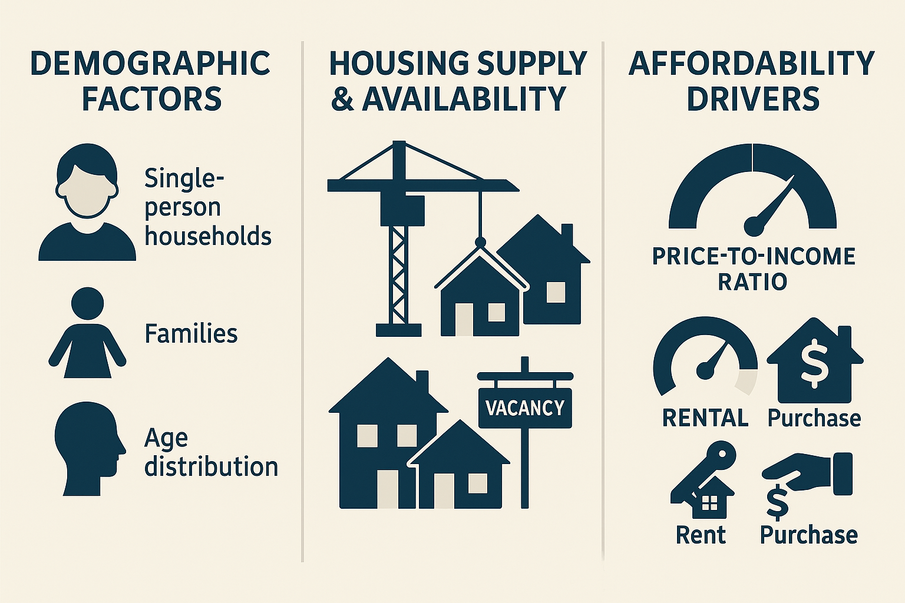

::: {.hero .text-center}
**Explore how economic, demographic, and housing factors influence rental versus homeownership trends across U.S. cities (2015–2023).**
:::

# Introduction

Choosing to rent or buy a home is one of the most consequential financial and lifestyle decisions individuals face. In recent years, rising housing costs, shifting employment patterns, and demographic changes have reshaped the U.S. housing landscape. This project digs into the interplay of macro-level forces—such as GDP growth, mortgage interest rates, and supply constraints—with micro-level drivers like household composition, income distribution, and local population growth to understand who rents, who owns, and why.

We begin by assembling a comprehensive dataset spanning 2015 through 2023, drawing on the U.S. Census Bureau for demographic indicators, FRED (Federal Reserve Economic Data) for economic metrics, and Zillow for real-estate market statistics. After cleaning and normalizing these inputs, we engineer new features—such as home-price‐to‐income ratios and rental vacancy rates—that capture affordability and availability pressures in each metropolitan area.

Using interactive visualizations, we then explore questions like:  
- How do fluctuations in mortgage rates correlate with shifts in homeownership versus rental shares?  
- To what extent do changes in household types (e.g., single‐person vs. family households) explain regional rental patterns?  
- Which cities buck national trends, and what local factors drive those exceptions?

By combining scatter-matrix plots, bubble‐chart comparisons, grouped boxplots, and parallel‐coordinate views, we deliver a multi-angle portrait of the housing market. Our goal is to equip policymakers, urban planners, and prospective residents with clear, data-driven insights into the forces shaping rental and homeownership across America.

# Explore the Visualizations

Select an analysis below:

::: columns

::: column
🔍 [View 1 - Factors: Mortgage rates, GDP, Household type](factors/scatter-matrix.html)  
A snapshot of pairwise relationships among key variables—mortgage rates, GDP, household type, and rental rates. Hover to view city-specific data points.
:::

::: column
🔍 [View 2 - Factors: CPI, Unemployment rate](factors/dual-bubble.html)  
Compare rental and homeownership rates across CPI and Unemployment rate. Bubble size represents population; color encodes factor categories.
:::

:::

::: columns

::: column
🔍 [View 3 - Factors: Income Tier, Education Attainment and Elderly Rate](factors/group-box.html)  
Visualize the distribution of rental and ownership rates across factor quartiles. Identify contrasts and outliers.
:::

::: column
🔍 [View 4 - Factors: MortgageRate, GDP and Non-Single Household](factors/parallel-coords.qmd)  
Trace multivariate trends by following lines through dimensions to detect correlated movements.
:::

:::

::: column
🔍 [View 5: Suitability choropleth](factors/view5.qmd)

:::

# Data & Methodology

- **Data Sources**: U.S. Census Bureau, Federal Reserve Economic Data (FRED), Zillow  
- **Time Frame**: 2015–2023  
- **Process**: Data cleaning, normalization, feature engineering, and interactive Quarto visualizations  

Here is the link to our interactive data table:

[Data Table](data-methods.qmd) 

# Contact

qc111@georgetown.edu

